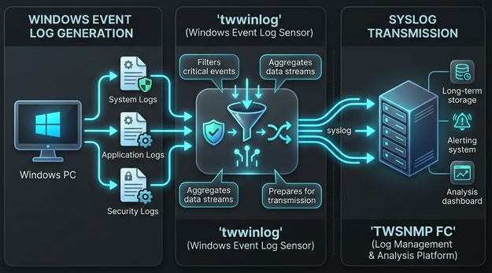

# twwinlog
Windows event log sensor for TWSNMP FC

English | [日本語](./README_ja.md)

[](http://godoc.org/github.com/twsnmp/twwinlog)
[](https://goreportcard.com/report/twsnmp/twwinlog)



## About twwinlog

twwinlog is a lightweight and efficient Windows Event Log collector and forwarder written in Go. It is designed to monitor Windows system, security, and application logs in real-time and forward them to external syslog servers or TWSNMP FC.

Unlike heavy agents, twwinlog focuses on simplicity and performance, making it ideal for both small-scale monitoring and enterprise environments where low resource overhead is critical.

### Key Features
- 🚀 High Performance: Built with Go for minimal CPU and memory footprint.
- 🔍 Powerful Filtering: Support for regular expression-based filtering to send only the logs you actually need.
- 📡 Flexible Forwarding: Supports standard Syslog (UDP/TCP) and optimized integration with TWSNMP FC.
- 🛠 Easy Deployment: Single binary execution with a simple YAML configuration.
- 🛡 Secure & Reliable: Stable event tracking using Windows Event Log API.

### Collectible Information

You can get the following information in the current version:

- Aggregation of the number of events
- Aggregation by event ID
- Logon information (4624, 4625, 4648, 4634, 4647)
- Account change information (4720, 4722, 4723, 4724, 4726, 4738, 4740, 4767, 4781)
- Privileged access information (4672, 4673)
- Kerberos authentication information (4768, 4769)
- Scheduled task information (4698)
- Process start and stop information (4688, 4689)
- Logon failure notifications (4625)
- Kerberos ticket request failure notifications (4768, 4769)
- Event log clearing notifications (1102)

## Status

The trial version V1.0.0 has been released.(2021/8/8)
Log transmission improvement version V1.1.0 has been released.(2021/8/21)
V1.1.2 has been released.(2025/1/26)
V2.0.0 has been released.(2026/3/25)
  - Added MQTT data transmission support and structured event logging.
  - Modified Syslog transmission to be non-blocking for better robustness.
  - Enhanced documentation with an infographic and English/Japanese separation.
  - Enabled GitHub Pages integration.

## Build

do make to build

```
$make
```

You can specify the following targets.
```
  all        Build executable files (omitted)
  clean      Delete the builded executable file
  zip        Create Zip files for release
```

```
$make
```
Execute the executable file for Windows in the `dist` directory.

To create a zip file for distribution,
```
$make zip
```

Is executed.The zip file is created in the `dist/` directory.

## Run

### Usage

```
Usage of twwinlog.exe:
  -auth string
        remote authentication:Default|Negotiate|Kerberos|NTLM
  -cpuprofile file
        write cpu profile to file
  -debug
        Debug Mode
  -interval int
        syslog send interval(sec) (default 300)
  -memprofile file
        write memory profile to file
  -mqtt string
        mqtt broker destination
  -mqttClientID string
        mqtt client id (default "twwinlog")
  -mqttPassword string
        mqtt password
  -mqttTopic string
        mqtt topic (default "twwinlog")
  -mqttUser string
        mqtt user name
  -password string
        remote user's password
  -remote string
        remote windows pc
  -syslog string
        syslog destination list
  -user string
        remote user name
```

| Parameters | Contents |
|---|---|
| Syslog | Syslog destination |
| Mqtt | MQTT broker destination |
| MqttClientID | MQTT client id |
| MqttUser/Password| MQTT user name and password |
| MqttTopic | MQTT topic |
| Interval | Check interval (sec) |
| Auth | Remote PC authentication method |
| User/Password | User name and password for authentication of remote PC |
| Remote | Remote PC |
| Debug | Debug Mode |

Syslog destinations can be specified multiple by separation of comma.
: You can also specify the port number.

```
-syslog 192.168.1.1,192.168.1.2:5514
```

### Start method

To start, you need to specify a Syslog destination(-syslog) or MQTT broker(-mqtt).

You can send to syslog with the following command.

```
>twwinlog.exe  -syslog 192.168.1.1
```

To send to MQTT broker, start with the following command.

```
>twwinlog.exe -mqtt 192.168.1.1
```

To monitor remote PC event log

```
>twwinlog.exe  -syslog 192.168.1.1 -remote <PC Address> -user <User> -password <Password>
```

## syslog message examle

The sentence of the transmitted syslog message is `local5`.TAG is `TwwinLog`.

This is an example of a log of the tallying by event ID.

```
type=EventID,computer=YMIRYZ,channel=System,provider=Microsoft-Windows-Dhcp-Client,eventID=50103,total=1,count=1,ft=2025-01-23T17:19:19+09:00,lt=2025-01-23T17:19:19+09:00
```

## TWSNMP FC Package

The TWWINLOG is included in the TWSNMP FC package.
Only Windows version.

For more information
https://note.com/twsnmp/n/nc6e49c284afb
Please see

## Copyright

see ./LICENSE

```
Copyright 2021-2026 Masayuki Yamai
```
